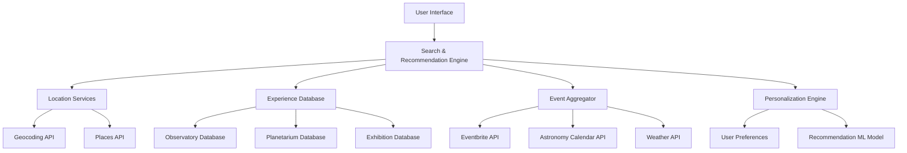

# ExploreX - System Design Document

## Overview

ExploreX is a comprehensive space travel recommendation system that combines location-based services, real-time event data, and intelligent recommendation algorithms to help users discover space-related experiences during their travels. The system integrates multiple APIs and data sources to provide personalized, up-to-date recommendations for observatories, planetariums, space exhibitions, workshops, and astronomical events.

## Architecture

### High-Level Architecture



### System Components

1. **Frontend Application**: React-based SPA with responsive design
2. **Search Engine**: Location-based experience discovery with filtering
3. **Recommendation Engine**: ML-powered personalization system
4. **Data Aggregation Layer**: Real-time integration with multiple APIs
5. **User Management**: Preferences, saved experiences, and itineraries
6. **Caching Layer**: Redis for performance optimization

## Components and Interfaces

### 1. User Interface Components

#### Search Interface
- **LocationInput**: Autocomplete location search with geocoding
- **DateRangePicker**: Flexible date selection with calendar widget
- **FilterPanel**: Experience type, budget, and accessibility filters
- **SearchButton**: Trigger recommendation engine with loading states

#### Results Display
- **ExperienceCard**: Individual experience with photos, ratings, and details
- **MapView**: Interactive map showing experience locations
- **ListView**: Sortable list with detailed information
- **FilterSidebar**: Real-time filtering and sorting options

#### Experience Details
- **ExperienceModal**: Detailed view with photos, reviews, and booking
- **ReviewSection**: User ratings and comments with moderation
- **BookingIntegration**: Direct links to reservation systems
- **ShareButtons**: Social sharing with custom URLs

#### Itinerary Planning
- **SavedExperiences**: User's saved experiences with organization
- **ItineraryBuilder**: Drag-and-drop itinerary creation
- **ScheduleOptimizer**: AI-powered schedule suggestions
- **ExportOptions**: PDF, calendar, and mobile app export

### 2. Backend Services

#### Location Service
```typescript
interface LocationService {
  geocodeLocation(query: string): Promise<GeoLocation>;
  reverseGeocode(lat: number, lng: number): Promise<Address>;
  findNearbyPlaces(location: GeoLocation, radius: number): Promise<Place[]>;
  validateLocation(location: string): Promise<ValidationResult>;
}
```

#### Experience Service
```typescript
interface ExperienceService {
  searchExperiences(criteria: SearchCriteria): Promise<Experience[]>;
  getExperienceDetails(id: string): Promise<ExperienceDetails>;
  getExperienceReviews(id: string): Promise<Review[]>;
  checkAvailability(id: string, date: Date): Promise<AvailabilityStatus>;
}
```

#### Event Service
```typescript
interface EventService {
  getEventsInArea(location: GeoLocation, dateRange: DateRange): Promise<Event[]>;
  getAstronomicalEvents(location: GeoLocation, dateRange: DateRange): Promise<AstroEvent[]>;
  getWeatherForecast(location: GeoLocation, date: Date): Promise<WeatherData>;
  getOptimalViewingTimes(location: GeoLocation, date: Date): Promise<ViewingWindow[]>;
}
```

#### Recommendation Service
```typescript
interface RecommendationService {
  getPersonalizedRecommendations(user: User, criteria: SearchCriteria): Promise<Recommendation[]>;
  updateUserPreferences(userId: string, interactions: UserInteraction[]): Promise<void>;
  generateItinerary(experiences: Experience[], constraints: ItineraryConstraints): Promise<Itinerary>;
  optimizeSchedule(itinerary: Itinerary): Promise<OptimizedItinerary>;
}
```

## Data Models

### Core Data Structures

#### Experience
```typescript
interface Experience {
  id: string;
  name: string;
  type: ExperienceType;
  description: string;
  location: GeoLocation;
  address: Address;
  operatingHours: OperatingHours[];
  admissionFee: PricingInfo;
  rating: number;
  reviewCount: number;
  photos: Photo[];
  amenities: Amenity[];
  accessibility: AccessibilityInfo;
  contactInfo: ContactInfo;
  website: string;
  lastUpdated: Date;
}

enum ExperienceType {
  OBSERVATORY = 'observatory',
  PLANETARIUM = 'planetarium',
  SPACE_MUSEUM = 'space_museum',
  ASTRONOMY_LAB = 'astronomy_lab',
  STARGAZING_SITE = 'stargazing_site',
  SPACE_CENTER = 'space_center',
  SCIENCE_CENTER = 'science_center'
}
```

#### Event
```typescript
interface Event {
  id: string;
  title: string;
  type: EventType;
  description: string;
  startDate: Date;
  endDate: Date;
  location: GeoLocation;
  venue: string;
  organizer: string;
  registrationRequired: boolean;
  registrationUrl?: string;
  capacity?: number;
  availableSpots?: number;
  price: PricingInfo;
  tags: string[];
  difficulty: DifficultyLevel;
}

enum EventType {
  WORKSHOP = 'workshop',
  STARGAZING = 'stargazing',
  LECTURE = 'lecture',
  EXHIBITION = 'exhibition',
  CONFERENCE = 'conference',
  WEBINAR = 'webinar',
  ASTRONOMICAL_EVENT = 'astronomical_event'
}
```

#### User Profile
```typescript
interface UserProfile {
  id: string;
  preferences: UserPreferences;
  savedExperiences: string[];
  visitHistory: VisitRecord[];
  itineraries: Itinerary[];
  reviews: Review[];
  createdAt: Date;
  lastActive: Date;
}

interface UserPreferences {
  experienceTypes: ExperienceType[];
  budgetRange: PriceRange;
  travelRadius: number;
  accessibilityNeeds: AccessibilityRequirement[];
  interests: InterestTag[];
  notificationSettings: NotificationSettings;
}
```

### API Integration Models

#### Weather Data
```typescript
interface WeatherData {
  location: GeoLocation;
  date: Date;
  temperature: TemperatureRange;
  cloudCover: number; // 0-100%
  visibility: number; // miles
  humidity: number; // 0-100%
  windSpeed: number; // mph
  precipitation: number; // inches
  astronomicalTwilight: TimeRange;
  moonPhase: MoonPhase;
  lightPollution: LightPollutionLevel;
}
```

#### Astronomical Events
```typescript
interface AstronomicalEvent {
  id: string;
  name: string;
  type: AstroEventType;
  description: string;
  startTime: Date;
  endTime: Date;
  visibility: VisibilityInfo;
  bestViewingLocations: GeoLocation[];
  difficulty: ViewingDifficulty;
  equipment: EquipmentRequirement[];
}

enum AstroEventType {
  METEOR_SHOWER = 'meteor_shower',
  PLANET_CONJUNCTION = 'planet_conjunction',
  LUNAR_ECLIPSE = 'lunar_eclipse',
  SOLAR_ECLIPSE = 'solar_eclipse',
  COMET_VISIBILITY = 'comet_visibility',
  ISS_FLYOVER = 'iss_flyover'
}
```

## Error Handling

### Error Categories and Responses

1. **Location Errors**
   - Invalid location: Suggest nearby alternatives
   - Geocoding failure: Fallback to manual coordinate entry
   - No experiences found: Expand search radius or suggest popular destinations

2. **API Integration Errors**
   - Weather API failure: Use cached data with staleness indicator
   - Event API timeout: Show cached events with update timestamp
   - Booking system unavailable: Provide alternative contact methods

3. **User Input Errors**
   - Invalid date range: Highlight constraints and suggest valid ranges
   - Missing required fields: Progressive disclosure with helpful hints
   - Search timeout: Partial results with option to refine search

4. **System Errors**
   - Database connection issues: Graceful degradation with cached data
   - Recommendation engine failure: Fallback to distance-based sorting
   - Authentication errors: Guest mode with limited functionality

### Error Recovery Strategies

```typescript
interface ErrorHandler {
  handleLocationError(error: LocationError): LocationErrorResponse;
  handleAPIError(service: string, error: APIError): APIErrorResponse;
  handleUserInputError(field: string, error: ValidationError): ValidationResponse;
  handleSystemError(error: SystemError): SystemErrorResponse;
}

interface ErrorResponse {
  message: string;
  suggestions: string[];
  fallbackOptions: FallbackOption[];
  retryable: boolean;
  userActions: UserAction[];
}
```

## Testing Strategy

### Unit Testing
- **Component Testing**: React components with Jest and React Testing Library
- **Service Testing**: API services with mocked external dependencies
- **Utility Testing**: Location calculations, date handling, and data transformations
- **Model Testing**: Data validation and transformation logic

### Integration Testing
- **API Integration**: External service integration with contract testing
- **Database Integration**: Data persistence and retrieval operations
- **Authentication Flow**: User registration, login, and session management
- **Search Functionality**: End-to-end search and recommendation workflows

### End-to-End Testing
- **User Journeys**: Complete user flows from search to itinerary creation
- **Cross-Browser Testing**: Compatibility across major browsers and devices
- **Performance Testing**: Load testing with realistic user scenarios
- **Accessibility Testing**: Screen reader compatibility and keyboard navigation

### Performance Testing
- **Load Testing**: Concurrent user scenarios with realistic data volumes
- **API Response Times**: External service integration performance
- **Database Query Optimization**: Complex search and recommendation queries
- **Caching Effectiveness**: Redis cache hit rates and performance impact

## Security Considerations

### Data Protection
- **User Privacy**: Minimal data collection with explicit consent
- **Location Privacy**: Optional location sharing with granular controls
- **Data Encryption**: End-to-end encryption for sensitive user data
- **GDPR Compliance**: Right to deletion and data portability

### API Security
- **Rate Limiting**: Prevent abuse of external API integrations
- **API Key Management**: Secure storage and rotation of service credentials
- **Input Validation**: Comprehensive sanitization of user inputs
- **CORS Configuration**: Proper cross-origin resource sharing setup

### Authentication & Authorization
- **OAuth Integration**: Social login with major providers
- **Session Management**: Secure session handling with proper expiration
- **Role-Based Access**: Different permission levels for users and administrators
- **Account Security**: Password requirements and two-factor authentication options

## Deployment Architecture

### Infrastructure Components
- **Frontend**: CDN-hosted static assets with global distribution
- **Backend**: Containerized microservices on cloud infrastructure
- **Database**: Managed PostgreSQL with read replicas for performance
- **Cache**: Redis cluster for session storage and API response caching
- **Search**: Elasticsearch for complex experience and event queries

### Monitoring and Analytics
- **Application Monitoring**: Real-time performance and error tracking
- **User Analytics**: Privacy-compliant usage patterns and feature adoption
- **API Monitoring**: External service availability and response times
- **Business Metrics**: Recommendation effectiveness and user satisfaction

### Scalability Considerations
- **Horizontal Scaling**: Auto-scaling based on traffic patterns
- **Database Optimization**: Query optimization and indexing strategies
- **CDN Strategy**: Global content distribution for optimal performance
- **Caching Strategy**: Multi-level caching for frequently accessed data